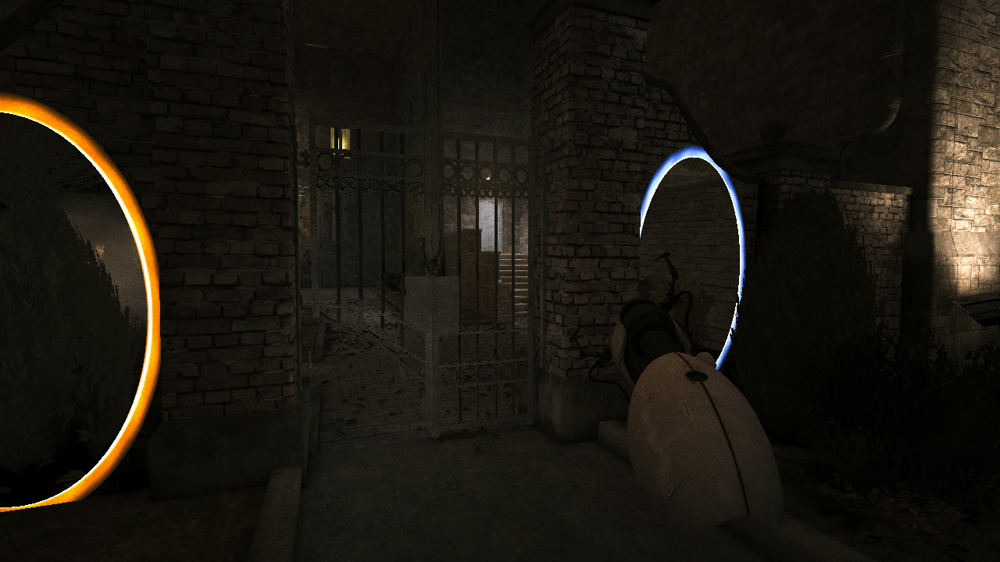
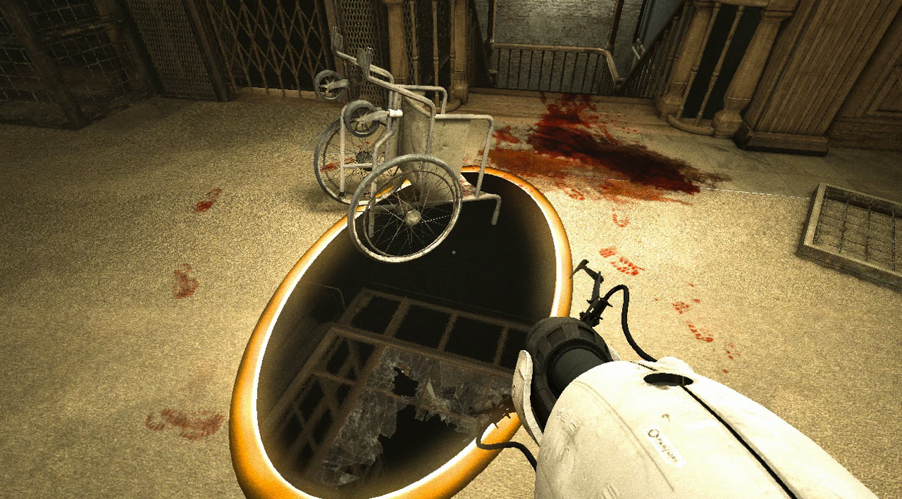
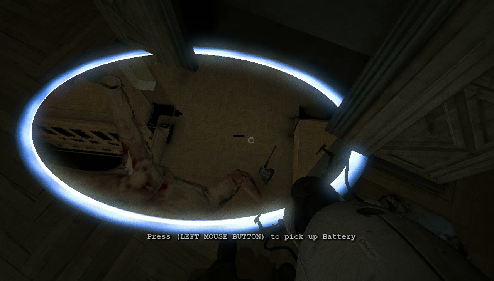
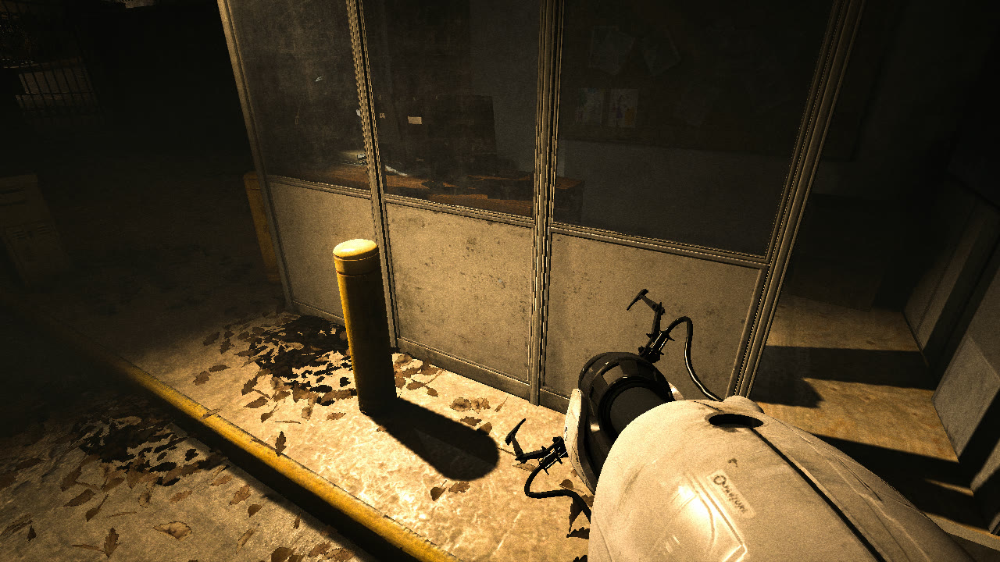
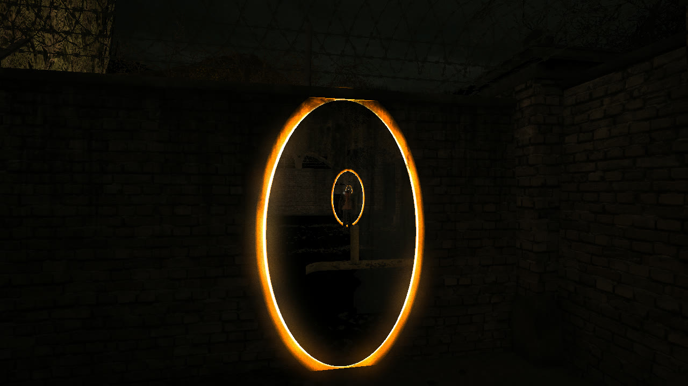

# Portal Asylum

**Portal 2's portal gun in Outlast.**

Shoot blue and orange portals onto the walls, floors and ceilings of Mount Massive Asylum. Look through them, and walk, fall or drop enemies and props through them.

The gun in Miles's hands is Portal 2's real viewmodel and the sounds are Portal 2's own. Both are read from **your** Portal 2 install on your PC, so nothing from Valve or Red Barrels is shipped here.

> Linux only: the native Linux version of Outlast on Steam (build 576074). Not Windows, not Proton.

**Download:** [portal-asylum-linux-x86_64.tar.gz](https://github.com/anas1412/portal-asylum/releases/latest/download/portal-asylum-linux-x86_64.tar.gz), from the [latest release](https://github.com/anas1412/portal-asylum/releases/latest). Then follow [Install](#install).



| | |
|---|---|
|  |  |
| *A floor portal under a wheelchair: you see straight through to the other side.* | *Looking down through a floor portal into the room below.* |
|  |  |
| *Portal 2's real gun, lit by Outlast's own lights.* | *Portals see each other: Miles and the blue portal, through the orange one.* |

## Features
- **See-through oval portals** with Portal 2 rims and an opening animation. Each portal shows a live view of the world behind the other one.
- **Teleporting.** Walk into wall portals and fall into floor portals. Two floor portals drop you out beside the exit instead of looping.
- **Enemies go through portals too.** Open one under or in front of a patient.
- **Props fall in** *(experimental)*. Small objects resting on a floor portal (a wheelchair, a chair) are turned into physics objects so they can drop through.
- **Shots work almost anywhere.**
  - They pass through gates, fences, bars, glass, people and invisible trigger zones.
  - They land on bumpy walls, ledges and even surfaces with no collision.
  - Doors and moving objects refuse portals, like in Portal 2.
- **The gun is a real in-game object**, lit by Outlast's own lights, with recoil. It's put away automatically while Miles climbs, hides, opens doors or uses the camcorder.
- **Extras:** every locked or barricaded door opens, and the camcorder battery never runs out.

## Controls
| Input | Action |
|---|---|
| Left mouse | Blue portal. When the game shows a "Press LEFT MOUSE BUTTON to…" prompt, it does that instead (doors, pickups, beds, lockers). |
| Right mouse | Orange portal |
| Middle mouse | Raise or lower the camcorder (it used to be on right mouse) |
| F | Night vision, while the camcorder is up |

Everything else is normal Outlast.

## Install

### 1. Install the two games
- **Outlast** on Steam, native Linux version.
  - Steam → Outlast → Properties → Compatibility: *Force the use of a compatibility tool* must be **off**.
- **Portal 2** on Steam. It only has to be installed, not played: the setup reads the gun model and sounds from its files. You can uninstall it after setup.

### 2. Get the mod
**Easiest: the prebuilt release** (no compiler needed). Download [portal-asylum-linux-x86_64.tar.gz](https://github.com/anas1412/portal-asylum/releases/latest/download/portal-asylum-linux-x86_64.tar.gz) from the [latest release](https://github.com/anas1412/portal-asylum/releases/latest), then:
```bash
mkdir -p ~/portal-asylum && tar -xzf ~/Downloads/portal-asylum-linux-x86_64.tar.gz -C ~/portal-asylum
```
**Or build it yourself** from the source:
```bash
git clone https://github.com/anas1412/portal-asylum ~/portal-asylum
```

### 3. Run the setup
The setup needs Python 3 and ffmpeg (and a C++ compiler, only if you build from source):
| Distro | Command |
|---|---|
| Arch / CachyOS / Manjaro | `sudo pacman -S --needed python ffmpeg` (add `base-devel git` to build) |
| Debian / Ubuntu / Mint | `sudo apt install python3 ffmpeg` (add `build-essential git` to build) |
| Fedora | `sudo dnf install python3 ffmpeg` (add `gcc-c++ git` to build) |

```bash
~/portal-asylum/install.sh
```
`install.sh`:
1. finds both games in your Steam libraries
2. builds the mod, if you cloned the source
3. converts the portal gun and its sounds from your Portal 2 into `cache/`
4. prints one line to paste into Steam

### 4. Add the launch option (once)
Steam → right-click **Outlast** → **Properties** → **General** → **Launch Options**. Paste the line `install.sh` printed. It looks like this:
```
LD_PRELOAD="$LD_PRELOAD:/home/YOU/portal-asylum/build/libolportal.so" systemd-run --user --scope --quiet -p MemoryMax=6G -p MemorySwapMax=1G %command%
```
- `LD_PRELOAD` loads the mod into Outlast when it starts. It's added to Steam's own value, so the Steam overlay keeps working.
- `systemd-run … MemoryMax=6G` runs Outlast in its own memory-limited group. If anything ever runs away, only Outlast is stopped, never your desktop.

## Start
Press **Play** on Outlast in Steam, as usual.
- Continue your save or start a new game. The portal gun is in Miles's hands from the first moment you can move.
- **Is it working?** You'll see the gun bottom right. The mod's log is in `~/portal-asylum/run/mod.log`.

## Remove
1. Steam → Outlast → Properties → **Launch Options**: clear the box. Outlast is back to normal.
2. Optional: delete the mod's folder.
   ```bash
   rm -rf ~/portal-asylum
   ```

The mod never changes a game file or your saves, so there's nothing else to undo.

## Update
- **Release download:** extract the new release over the old folder, then run `~/portal-asylum/install.sh` again.
- **Git clone:**
  ```bash
  cd ~/portal-asylum && git pull && ./install.sh --rebuild
  ```

## Troubleshooting
| Problem | Fix |
|---|---|
| No gun in Miles's hands | Check the launch option is pasted exactly, then look at `run/mod.log`. If there's no log at all, the mod didn't load. Make sure Outlast isn't running through Proton. |
| `install.sh`: "not the native Linux version" | Turn off *Force the use of a compatibility tool* for Outlast, let Steam update it, and run `install.sh` again. |
| A wall won't take a portal | Some things refuse on purpose: doors and moving objects. Anything else: open an issue with the end of `run/mod.log`, which says why each shot failed. |
| Stuck after skipping ahead | Unlocked doors and portals can get you past a scripted scene. Reload the last checkpoint. |
| Low FPS | The portals barely cost anything, but Outlast itself is heavy on laptops. Check your fans and temperatures. |

## How it works
Outlast's native Linux binary still has its C++ symbol names. Portal Asylum is an `LD_PRELOAD` library that drives the game through Unreal Engine 3's own reflection and functions.

- **`src/loader.cpp`** hooks:
  - the engine tick and player input, through vtable slots
  - the game's SDL audio callback, to mix in Portal 2's sounds
  - the buffer swap

  It loads `build/libolportal_mod.so`, which can be hot-reloaded during development.
- **`src/mod.cpp`**: portals, teleporting, the gun, props, doors and the battery.
  - **Portals** are spawned actors. The engine's sphere mesh is rebuilt at runtime into a flat oval (`src/mesh.h`).
  - **Each see-through view** is a scene capture from your eye moved through the portal pair. It uses an off-axis projection whose window is the exit portal, so the picture lines up exactly with the opening.
  - **The gun** is Portal 2's `v_portalgun`, rebuilt into an engine mesh and attached to Miles's camera bone. It uses the camcorder's lit material.
- **`src/ue.h`**: minimal UE3 object access (names, properties and functions by name, `ProcessEvent`).
- **`tools/p2gun.py`**: reads Portal 2's VPK, MDL, VVD, VTX and VTF files and writes `cache/gun.bin` and `cache/sounds/`.
- **[MODLOG.md](MODLOG.md)**: engine offsets, the reverse-engineering notes and every gotcha hit along the way.

### Development
- `./dev-run.sh` starts Outlast windowed with the mod.
- Commands appended to `run/cmd` run inside the game (`info`, `fire 0`, `shot name`, `objs <text>`, `props <addr>`, …). `tools/drive.py` scripts them.
- `touch run/reload` reloads the mod without restarting the game.

## Credits
- Portal and Portal 2 © Valve Corporation. Outlast © Red Barrels.
- This is a fan mod, not affiliated with either. It uses their files only from your own installs.
- Built with an AI coding agent (Claude), following the [universal-modder](https://github.com/rehan-remade/universal-modder) method.

## License
[MIT](LICENSE) for the mod's own code. Game assets belong to their owners and are not part of this repository.
